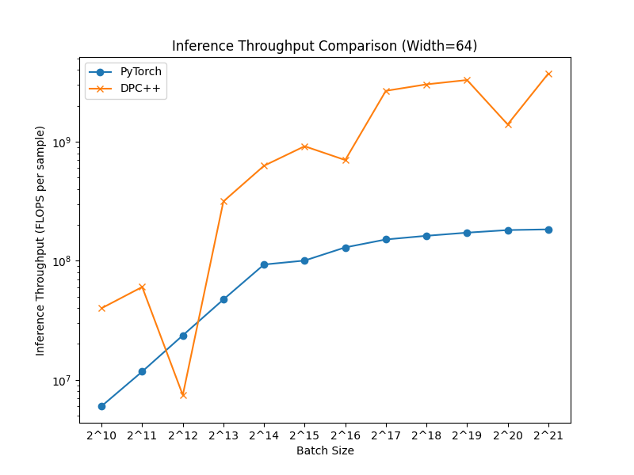
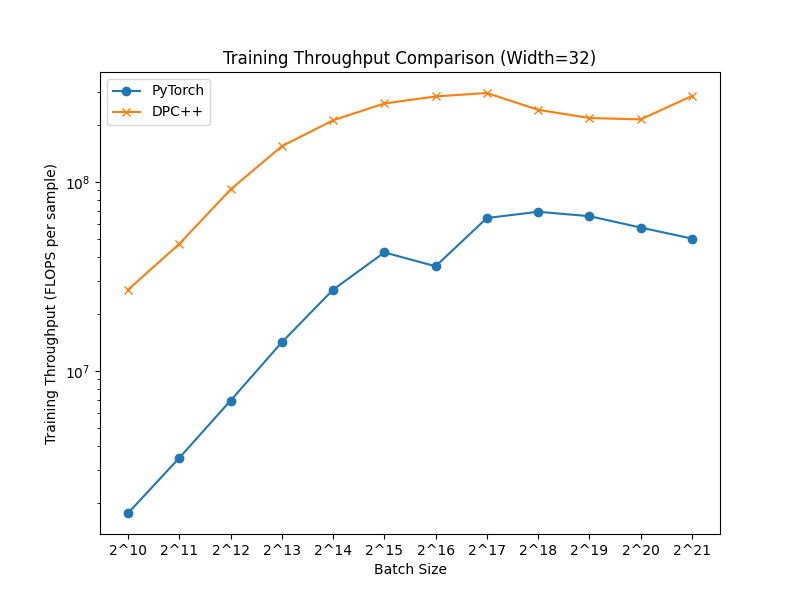
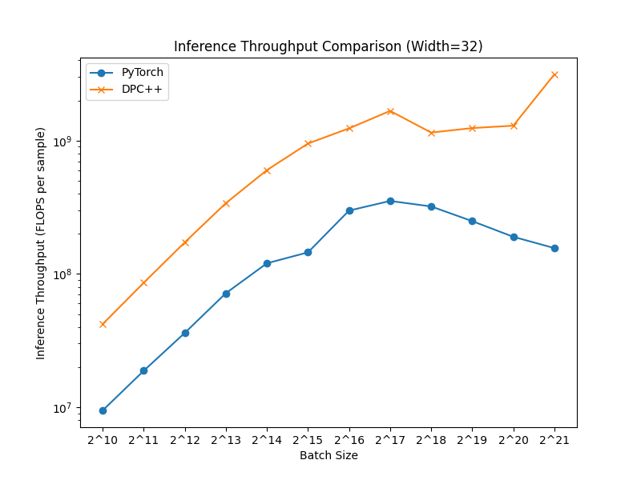

## Introduction

This repository implements a GPU-accelerated tiny neural network framework using Intel hardware, based on the [original CUDA implementation](https://github.com/NVlabs/tiny-cuda-nn). The implementation uses the Intel DPC++ compiler and relies on the SYCL language with optional ESIMD acceleration.

The network is optimized for loading both activation matrices and weights matrices into the GPU's fast L1 memory and registers. Computation of matrix multiplications is executed using Intel's `joint_matrix` extension, a high-level wrapper for systolic array operations.

## Performance

We benchmarked the thoughput of our network in training and inference on both [Intel Data Center GPU Max Series (Ponte Vecchio)](https://www.intel.com/content/www/us/en/products/details/discrete-gpus/data-center-gpu/max-series.html) and [Intel Arc Series](https://www.intel.com/content/www/us/en/products/details/discrete-gpus/arc.html) and compared our network with PyTorch.

To replicate the performance of the dpcpp code, please set `BUILD_BENCHMARK=ON` in `tiny-dpcpp-nn/CMakeLists.txt`, build `benchmark-all` and run the benchmark from the `build/` folder using

```bash
I_MPI_DEBUG=3 I_MPI_OFFLOAD=1 I_MPI_OFFLOAD_DOMAIN=[1,2] mpirun -n 2 ./benchmarks/benchmark-all
```

To replicate the performance of the pytorch code, please run

```bash
cd python/ && python benchmark_pytorch.py
```

Finally, plot the results using

```bash
python benchmarks/plot_results.py
```

### Performance on PVC

We reach up 60x to compared to PyTorch:
<table>
<tr>
<td>

</td>
<td>

</td>
</tr>
</table>

### Performance on Arc 770

We reach up to 20x compared to PyTorch:
<table>
<tr>
<td>

</td>
<td>

</td>
</tr>
</table>

## Features

- High-Performance Computing: Optimized to run efficiently on Intel Data Center GPUs, enabling high-throughput training and inference with up to 60x over PyTorch.
- Compatibility with PyTorch: Provides Python bindings that integrate seamlessly with the PyTorch ecosystem, enabling users to include GPU-accelerated MLPs in PyTorch applications.
- Versatile Neural Network Structures: Supports networks with multiple hidden layers and a variety of neuron configurations to fit different use cases and performance requirements.
- Multi-Resolution Hash Encoding: Includes implementation of [Multi-Resolution Hash Encoding](https://nvlabs.github.io/instant-ngp/), allowing the network to handle high-frequency features effectively.
- Cross-Platform Utilization: Designed to be run on various Intel GPUs, maximizing the portability and usability of the framework across different systems.

## Documentation

For a detailed documentation, please refer to [tiny-dpcpp-nn documentation](https://intel.github.io/tiny-dpcpp-nn/) and for a detailed description of our fully-fused algorithm, please refer to our [paper](https://arxiv.org/abs/2403.17607)
## Build

To build the tiny-nn librairy, you can clone the github repo on your machine and put your code in the source folder. After cloning, if you choose to use the pybindings, please recursive pull the pybind11 repositories via

```bash
git submodule update --init -- extern/pybind11
```

Then you can build the library using :

```bash
source /opt/intel/oneapi/setvars.sh
mkdir build && cd build/
cmake -D<options>=<ON/OFF> ..
make
```

where <options> are options that can be toggled on or off. See [Build Options](https://intel.github.io/tiny-dpcpp-nn/manual/build.html#build-options)

Note: To make the use of the network, you have to disable the implicit scaling on PVC which can be done by uncommenting the portion of the code indicated in the sample when creating the queue.

## PyTorch extension
### Installation
We provide a pybind wrapper of our tiny-dpcpp-nn implementation for seamless integration into PyTorch. Please refer to [tiny-dpcpp-nn pybind documentation](https://intel.github.io/tiny-dpcpp-nn/manual/pytorch.html) for details.

Please recursively pull the `pybind11` library:
```bash
git submodule update --init -- extern/pybind11
```

[Optional] - Load correct drivers, i.e., ensure that oneAPI and agama version match the required [IPEX version](https://intel.github.io/intel-extension-for-pytorch/index.html#installation)
```bash
module load intel-comp-rt/agama-ci-devel/803.29 intel/oneapi/2024.1 cmake/3.26.0
```

[Optional] - Create a conda environment
```bash
conda create -n tiny-dpcpp-nn python=3.10 -y
conda activate tiny-dpcpp-nn
```

[Install PyTorch (at the point of writing 2.7)](https://pytorch.org/docs/stable/notes/get_start_xpu.html):

```
pip install -r requirements.txt
```

Verify that drivers and PyTorch are installed correctly:

```
python -c "import torch; print(torch.xpu.is_available())"

Install the module (if no `TARGET_DEVICE` is set, the target_device in setup.py is set to `ARC`. Currently `PVC` and `ARC` is supported):
```bash
cd dpcpp_bindings
TARGET_DEVICE=ARC pip install -e .
```

### Test the install
To test that the installation was successful, you can do the following four tests.

```bash
cd test/python/ && pytest
```

and run the two python sample scripts:

```bash
cd samples && python benchmark_pytorch.py
```

```bash
cd samples && python mlp_learning_an_image_pytorch.py
```
## Tests

When setting the additional flag `BUILD_TORCH_TEST=ON`, the libtorch tests (`tnn_api.h`) will be built.

To have all tests, run:

```bash
cmake -DTARGET_DEVICE="PVC" -DBUILD_TORCH_TEST="ON" ..
```

After all tests are build into `build/`, you cvan run `cd build/ && make tests` to verfiy that the setup is correct. Please note that we provide tests for both the core `dpcpp` implementation and the `libtorch` wrapper implementation.

To test whether the pytorch bindings were installed correctly, please run

- `pytest python/tests/test_compare_torch_dpcpp.py` to ensure that forward and backward passes work properly.
- `python/tests/test_training_classification.py` and `python/tests/test_training_regression.py` to see if integration into PyTorch's optimiser works, and

## Acknowledgement

- The repository was developed and is maintained by Christoph Bauinger (christoph.bauinger@intel.com) and Kai Yuan (kai.yuan@intel.com).
- The original implementation of SwiftNet was conducted by Darius Dabert ([DariusDabert](https://github.com/DariusDabert)) and Adrien Tousnakhoff ([Tousnaaa](https://github.com/Tousnaaa))

## Citation

If you found this work useful, please consider citing this work as:

```bibtex
@software{tiny-dpcpp-nn,
    author = {Bauinger, Christoph and Yuan, Kai},
    license = {BSD-3-Clause},
    month = {3},
    title = {{tiny-dpcpp-nn}},
    url = {https://github.com/intel/tiny-dpcpp-nn/},
    version = {0.1},
    year = {2024}
}
```
